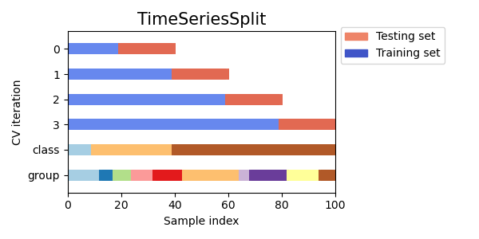

# Treino do modelo de ML com previsão D+1

Agora um modelo de ML de regressão supervisionado será implementado para previsão do preço de pretróleo em D+1, seguindo boas práticas para o treino de modelo de ML para série temporal:

- **Divisão de Dados**: Dividir os dados em conjuntos de treino e teste de forma sequencial para preservar a ordem temporal.

- **Normalização**: Escalar os dados para melhorar a performance do modelo.

- **Validação Cruzada**: Utilizar técnicas como validação cruzada em blocos para avaliar a performance do modelo em diferentes períodos de tempo.

A ordem dos dados importa quando se trata de série temporal, por isso não se deve usar a função `train_test_split` do sci-kit learning para dividir os dados, pois ela faz isso randomicamente.

A seguir, a divisão do conjunto de dados original é feita obedecendo a ordem dos dados, sendo 90% para o conjunto de dados de treino e 10% para o conjunto de dados de teste.

```python
# divisão manual dos dados de treino e teste
train_size = int(len(eia366) * 0.9)
train, test = eia366.iloc[:train_size], eia366.iloc[train_size:]
```

Na sequência é implementada a classe `FeatureEngineer` para que a engenharia de features seja feita com a classe `Pipeline` ([https://scikit-learn.org/stable/modules/generated/sklearn.pipeline.Pipeline.html](https://scikit-learn.org/stable/modules/generated/sklearn.pipeline.Pipeline.html)) do sci-kit learn, ainda no `Pipeline` os dados são normalizados com a classe `StandardScaler` ([https://scikit-learn.org/stable/modules/generated/sklearn.preprocessing.StandardScaler.html](https://scikit-learn.org/stable/modules/generated/sklearn.preprocessing.StandardScaler.html)), e é usada classe `GradientBoostingRegressor` ([https://scikit-learn.org/stable/modules/generated/sklearn.ensemble.GradientBoostingRegressor.html](https://scikit-learn.org/stable/modules/generated/sklearn.ensemble.GradientBoostingRegressor.html)) como modelo para treino.

Para validação cruzada no treino do modelo, será utilizada a classe `TimeSeriesSplit` ([https://scikit-learn.org/stable/modules/generated/sklearn.model_selection.TimeSeriesSplit.html](https://scikit-learn.org/stable/modules/generated/sklearn.model_selection.TimeSeriesSplit.html)) que lida com dados de série temporal para essa tarefa.

<div align="center">
  <figure>
    
    <figcaption>
      Fonte: <a href="https://scikit-learn.org/stable/auto_examples/model_selection/plot_cv_indices.html#sphx-glr-auto-examples-model-selection-plot-cv-indices-py">Scikit-learn - Cross-validation indices</a>
    </figcaption>
  </figure>
</div>

E é configurado do `HalvingGridSearchCV` ([https://scikit-learn.org/stable/modules/generated/sklearn.model_selection.HalvingGridSearchCV.html](https://scikit-learn.org/stable/modules/generated/sklearn.model_selection.HalvingGridSearchCV.html)) para busca da melhor combinação de hiperparâmetros. O `HalvingGridSearchCV` pode ser uma opção melhor que o clássico `GridSearchCV` ([https://scikit-learn.org/stable/modules/generated/sklearn.model_selection.GridSearchCV.html](https://scikit-learn.org/stable/modules/generated/sklearn.model_selection.GridSearchCV.html)) quando é necessário otimizar hiperparâmetros de forma eficiente e escalável, especialmente em cenários com muitos hiperparâmetros e grandes volumes de dados, onde a busca exaustiva do `GridSearchCV` seria impraticável.

Aqui estão os principais parâmetros assumidos pelo `HalvingGridSearchCV`:

**`estimator=pipeline`**:
   - Este é o estimador que será ajustado durante a busca de hiperparâmetros. No caso, é um pipeline que inclui engenharia de features, padronização e o modelo `GradientBoostingRegressor`.

**`param_grid=param_grid`**:
   - Este é o dicionário que contém as combinações de hiperparâmetros que serão testadas para o `GradientBoostingRegressor`, que são:
     - `"model__n_estimators": [100, 200]`: Número de árvores na floresta.
     - `"model__learning_rate": [0.05, 0.1]`: Taxa de aprendizado usada na atualização das estimativas.

**`cv=tscv`**:
   - Este é o método de validação cruzada a ser utilizado. A classe `TimeSeriesSplit` é usada para garantir que a divisão dos dados respeite a natureza temporal dos mesmos, com 3 divisões (`n_splits=3`).

**`factor=3`**:
   - Este parâmetro define o fator de redução no processo de "halving". A cada etapa, apenas 1/3 das combinações de hiperparâmetros mais promissoras passam para a próxima etapa.

**`scoring="neg_mean_squared_error"`**:
   - Este é o critério usado para avaliar o desempenho dos modelos. No caso, é o erro quadrático médio negativo (quanto menor, melhor).

**`verbose=1`**:
   - Este parâmetro controla o nível de verbosidade da saída durante o ajuste. `verbose=1` significa que mensagens informativas sobre o progresso serão impressas.

**`n_jobs=-1`**:
   - Este parâmetro define o número de threads a serem usadas para o ajuste dos modelos. `n_jobs=-1` indica que todas as CPUs disponíveis devem ser usadas.

O `HalvingGridSearchCV` começa avaliando todas as combinações de hiperparâmetros no conjunto inicial (definido pelo `param_grid`) usando uma pequena fração dos dados. Após essa avaliação inicial, ele retém apenas uma fração das melhores combinações (definida pelo `factor`) e aumenta a quantidade de dados utilizada na próxima etapa. Esse processo se repete até que todas as combinações restantes sejam avaliadas usando todos os dados disponíveis ou até que um critério de parada seja atingido. O resultado final é a combinação de hiperparâmetros que apresentou o melhor desempenho ao longo das etapas, utilizando de maneira eficiente os recursos computacionais disponíveis.

```python
from sklearn.ensemble import GradientBoostingRegressor
from sklearn.experimental import enable_halving_search_cv  # noqa
from sklearn.model_selection import HalvingGridSearchCV
from sklearn.model_selection import TimeSeriesSplit
from sklearn.pipeline import Pipeline
from sklearn.preprocessing import StandardScaler
from sklearn.base import BaseEstimator, TransformerMixin

# classe customizada para engenharia de features
class FeatureEngineer(BaseEstimator, TransformerMixin):
    def __init__(self, target, lags, window_size):
        self.target = target
        self.lags = lags
        self.window_size = window_size

    def fit(self, X, y=None):
        return self

    def transform(self, X):
        X = X.copy()
        for lag in range(1, self.lags + 1):
            X[f"lag_{lag}"] = X[self.target].shift(lag)
        X[f"rolling_mean_{self.window_size}"] = X[self.target].shift(1).rolling(window=self.window_size).mean()
        X["diff"] = X[self.target].shift(1).diff()
        X["month"] = X.index.month
        X["day_of_week"] = X.index.dayofweek
        X[f"rolling_std_{self.window_size}"] = X[self.target].shift(1).rolling(window=self.window_size).std()
        X["day"] = X.index.day
        X["quarter"] = X.index.quarter
        X["year"] = X.index.year
        X = X.drop(columns=["value_usd"])
        X.fillna(0, inplace=True)
        return X

# pipeline de steps
pipeline = Pipeline([
    ("feature_engineering", FeatureEngineer(target="value_usd", lags=7, window_size=7)),
    ("scaler", StandardScaler()),
    ("model", GradientBoostingRegressor())
])

# espaço amostral de hiperparâmetros
param_grid = {
    "model__n_estimators": [100, 200],
    "model__learning_rate": [0.05, 0.1]
}

# TimeSeriesSplit para validação cruzada
tscv = TimeSeriesSplit(n_splits=3)

# HalvingGridSearchCV para busca de melhor combinação de hiperparâmetros
search = HalvingGridSearchCV(
    estimator=pipeline,
    param_grid=param_grid,
    cv=tscv,
    factor=3,
    scoring="neg_mean_squared_error",
    verbose=1,
    n_jobs=-1
)

X = train.copy()  # inclui a coluna 'value_usd' no X para uso no pipeline de feature engineering
y = train["value_usd"]

# fit do modelo
search.fit(X, y)

# melhores hiperparâmetros e score
print("Best parameters found: ", search.best_params_)
print("Best score: ", search.best_score_)
```

A seguir é implementado um código para checar a importância das variáveis criadas com a engenharia de features. Checar a importância das variáveis é uma prática essencial em ML que ajuda nas seguintes situações:
- interpretação;
- seleção de variáveis;
- insights e descobertas;
- documentação e auditoria;

A importância de features do `GradientBoostingRegressor` varia de 0 a 1 porque os valores são calculados com base na contribuição de cada feature para a melhoria da função de perda e, em seguida, normalizados para que a soma total seja 1. Isso facilita a interpretação e comparação das importâncias relativas das features no modelo. 

Então para features com valores próximos de 0, indica que a feature não foi usada em nenhuma divisão ao longo das árvores, ou seja, não contribuiu para a melhoria da função de perda. 

E para features com valores próximos de 1, indica que a feature foi extremamente importante, contribuindo significativamente para a melhoria da função de perda em muitas divisões ao longo das árvores.

```python
import pandas as pd

# acessando o melhor modelo encontrado
best_model = search.best_estimator_

# extraindo o transformador de engenharia de features
feature_engineering = best_model.named_steps["feature_engineering"]

# transformando X para obter o nome das features geradas
X_transformed = feature_engineering.transform(X)
feature_names = X_transformed.columns

# acessando as importâncias das features
importances = best_model.named_steps["model"].feature_importances_

# DataFrame para as importâncias das features
importance_df = pd.DataFrame({
    "Feature": feature_names,
    "Importance": importances
}).sort_values(by="Importance", ascending=False)

# plotando o gráfico de barras horizontal
plt.figure(figsize=(10, 8))
plt.barh(importance_df["Feature"], importance_df["Importance"], color="skyblue")
plt.xlabel("Importância")
plt.ylabel("Features")
plt.title("Importância de Features")
plt.gca().invert_yaxis()  # Inverte o eixo y para a feature mais importante aparecer no topo
plt.show()
```