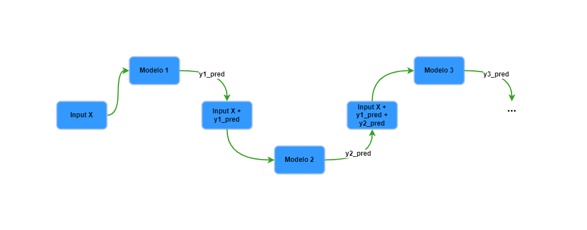

# Treino do modelo de ML com previsão D+15

Agora o código para previsão de D+1 será adequado para previsão do preço de pretróleo em D+15.

Nesse código é adicionada a classe `RegressorChain` com `GradientBoostingRegressor` para previsões encadeadas de múltiplos passos à frente, no caso 15 dias. 

O `RegressorChain` possibilita que cada modelo utilize não apenas as predições do modelo anterior, mas todas as predições dos modelos anteriores e o conjunto de dados de variáveis independentes. O processo é sequencial e acumulativo conforme expresso no desenho a seguir.

<div align="center">
  <figure>
    
    <figcaption>
      Fonte: Elaboração própria
    </figcaption>
  </figure>
</div>

Ainda é aplicada engenharia de features com lags, médias e desvio padrão móveis de 15 dias.

E o espaço amostral de hiperparâmetros é adaptado para a utilização do `RegressorChain`.

A abordagem de previsão encadeada é útil quando se deseja prever múltiplos passos futuros simultaneamente, levando em consideração a dependência entre as previsões.

```python
from sklearn.multioutput import RegressorChain
from sklearn.ensemble import GradientBoostingRegressor
from sklearn.experimental import enable_halving_search_cv  # noqa
from sklearn.model_selection import HalvingGridSearchCV
from sklearn.model_selection import TimeSeriesSplit
from sklearn.pipeline import Pipeline
from sklearn.preprocessing import StandardScaler
from sklearn.base import BaseEstimator, TransformerMixin
import pandas as pd

# classe customizada para engenharia de features
class FeatureEngineer(BaseEstimator, TransformerMixin):
    def __init__(self, target, lags, window_size):
        self.target = target
        self.lags = lags
        self.window_size = window_size

    def fit(self, X, y=None):
        return self

    def transform(self, X):
        X = X.copy()
        for lag in range(1, self.lags + 1):
            X[f"lag_{lag}"] = X[self.target].shift(lag)
        X[f"rolling_mean_{self.window_size}"] = X[self.target].shift(1).rolling(window=self.window_size).mean()
        X["diff"] = X[self.target].shift(1).diff()
        X["month"] = X.index.month
        X["day_of_week"] = X.index.dayofweek
        X[f"rolling_std_{self.window_size}"] = X[self.target].shift(1).rolling(window=self.window_size).std()
        X["day"] = X.index.day
        X["quarter"] = X.index.quarter
        X["year"] = X.index.year
        X = X.drop(columns=["value_usd"])
        X.fillna(0, inplace=True)
        return X

# pipeline de steps
pipeline = Pipeline([
    ("feature_engineering", FeatureEngineer(target="value_usd", lags=15, window_size=15)),
    ("scaler", StandardScaler()),
    ("model", RegressorChain(base_estimator=GradientBoostingRegressor()))
])

# espaço amostral de hiperparâmetros
param_grid = {
    "model__base_estimator__n_estimators": [100, 200],
    "model__base_estimator__learning_rate": [0.05, 0.1],
}

# TimeSeriesSplit para validação cruzada
tscv = TimeSeriesSplit(n_splits=3)

# HalvingGridSearchCV para busca de melhor combinação de hiperparâmetros
search = HalvingGridSearchCV(
    estimator=pipeline,
    param_grid=param_grid,
    cv=tscv,
    factor=3,
    scoring="neg_mean_squared_error",
    verbose=1,
    n_jobs=-1
)

X = train.copy()  # inclui a coluna 'value_usd' no X para uso no pipeline de feature engineering
y = pd.concat([train["value_usd"].shift(-i) for i in range(1, 16)], axis=1).dropna()  # criando as colunas para previsão de D+15
y.columns = [f"value_usd_t{i}" for i in range(1, 16)]
X = X.iloc[:len(y)]  # alinhando X e y

# fit do modelo
search.fit(X, y)

# melhores hiperparâmetros e score
print("Best parameters found: ", search.best_params_)
print("Best score: ", search.best_score_)
```
