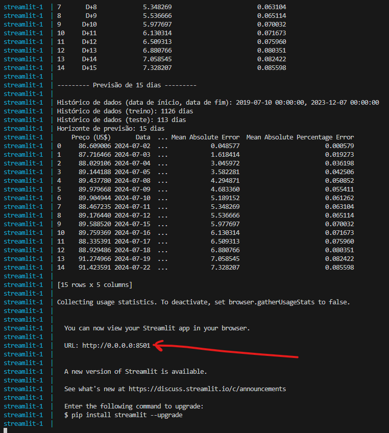
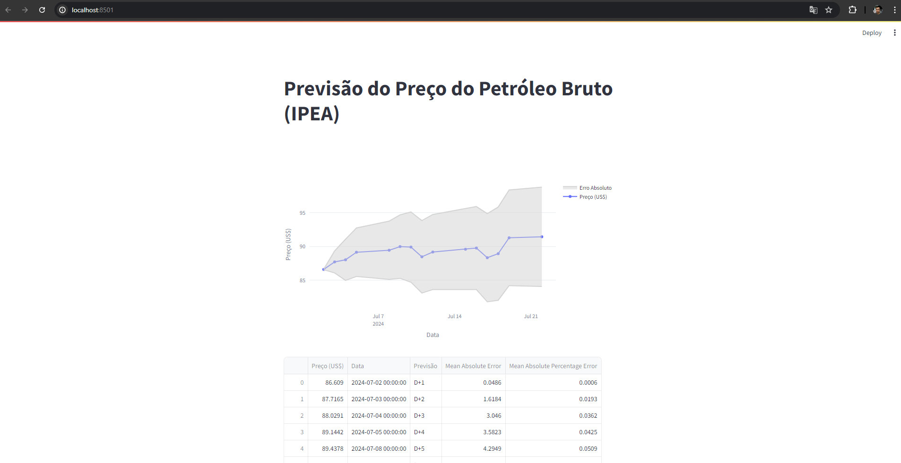
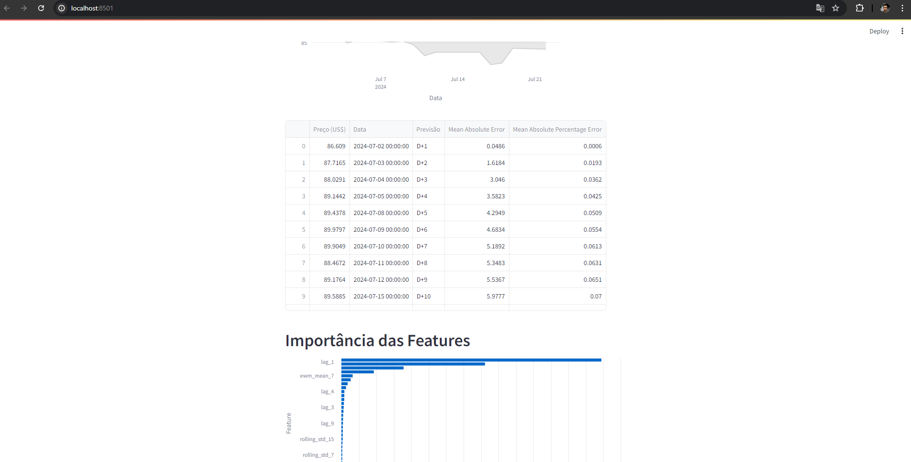

# Execução da Aplicação

Para executar a aplicação, na raíz do depositório executar:

```bash
docker-compose up --build
```

O script `model_training/main.py` para de treino do modelo será executado primeiro.

<div align="center">
  <figure>
    
  </figure>
</div>

Após a conclusão da execução do script de treino e previsões, dois arquivos serão persistidos no diretório `streamlit`, que são `importance_df.csv` com a Importância de Features obtida com o treino do modelo, e o `preds_df.csv` com as previsões do preço do petróleoe respectivos erros, ambos são insumos para a aplicação do Streamlit.

Acessando a URL fornecida podemos ver o gráfico com as previsões:

<div align="center">
  <figure>
    
  </figure>
</div>

A tabela com as previsões:

<div align="center">
  <figure>
    
  </figure>
</div>

E o gráfico com importância de features:

<div align="center">
  <figure>
    
  </figure>
</div>
